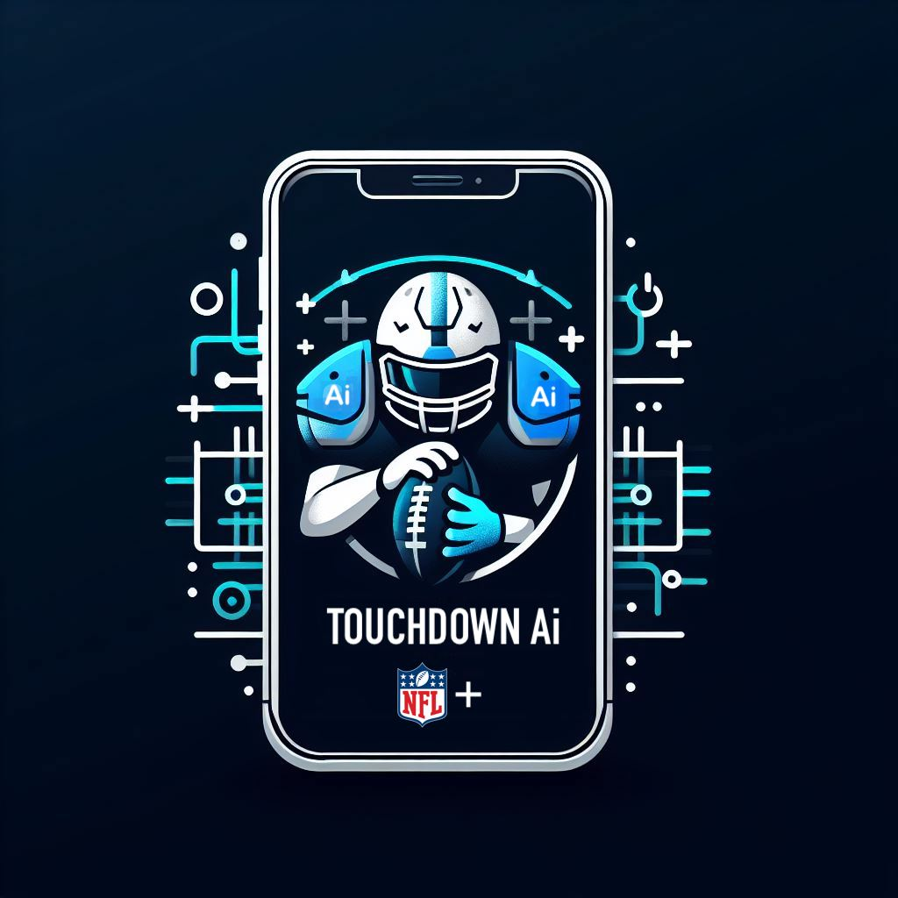

# Team Alabama A&M University - HBCU Battle of the Brains

## AI Readme
This folder contains explorations of how our team uses Artificial Intelligence for our solution, TouchdownAI. It contains models we trained to demonstrate functionality for TouchdownAI, with each subfolder accompanied by a README outlining the specific features.

*Setup and Installation Instructions*

To run the notebooks, we used Google Colaboratory along with some publicly available libraries for data analysis. If you are not using Colab, ensure to install libraries such as numpy, pandas, sklearn, seaborn, and others.

*Disclaimer:*

Some features presented in this directory are not currently deployed on our web application, but they serve as demonstrations of our implementation capabilities. This collection provides insights into the potential future features of our solution.

