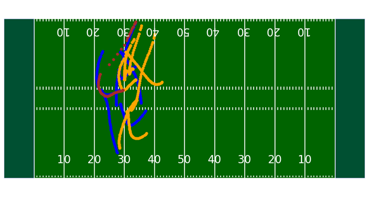

# Team Alabama A&M University - HBCU Battle of the Brains

# Concussion Data Exploration

## Description
This notebook analyses data on concussions in the NFL form 2012-2013, the data includes information such as players, when they were injured, how many games they missed and other information. We used it to display how TouchdownAI might extract information about reasons for players missing games or players and teams with injuries, if NFL+ users request that information as they use the service.

It uses a Random Forest Regression model to calculate the feature importances of different parts of models, which would be useful in determining performance or participation or return of specific players if used with real NFL data. An example showing the feature importance is shown below:

 
  

## Data Sources
NFL Concussions - https://sportsandsociety.osu.edu/sports-data-sets 
