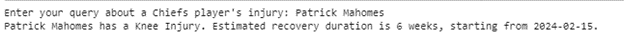

# Team Alabama A&M University - HBCU Battle of the Brains

# Injury Tracker

## Description
This notebook Initializes simulated injury data for NFL players associated with the Chiefs team. It creates a data frame from this data, displays its contents, and saves it to a CSV file which is then used for analysis and information retrieval. 

We then used a Natural Language Understanding Model to query responses from the simulated data as shown below. This can be used in Touchdown AI to build the chatbot that can understand and respond to user queries about games, and players in the NFL+ app.

 
  

Sample result from query

## Data Sources
We formulated the data used in this notebook.

