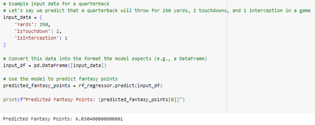

# Team Alabama A&M University - HBCU Battle of the Brains

#Play by Play

## Description
This notebook analyses play by play data from 2022 and 2023, and does a comprehensive analysis of both. We used a Linear Regression model to predict the average yards gained per play based on a team's average yards per game and touchdowns per game, an engineered feature based on features available in the dataset. We also worked through a Team Win Probability Model using a Random Forest Classifier as well as a simple predictive analysis for fantasy football using a Random Forest Regressor model.

All this information will be used in TouchdownAI to drive user engagement by providing predictions for points that a certain player might get based on past data. Another use case would be for subscribers also using Fantasy football to get predicted fantasy points, as shown in the example below.

  
 
Excerpt from code showing usage of the Model to predict quaterback's point

## Data Sources
2023 play by play - https://nflsavant.com/pbp_data.php?year=2023 
2022 play by play - https://nflsavant.com/pbp_data.php?year=2022 
 
